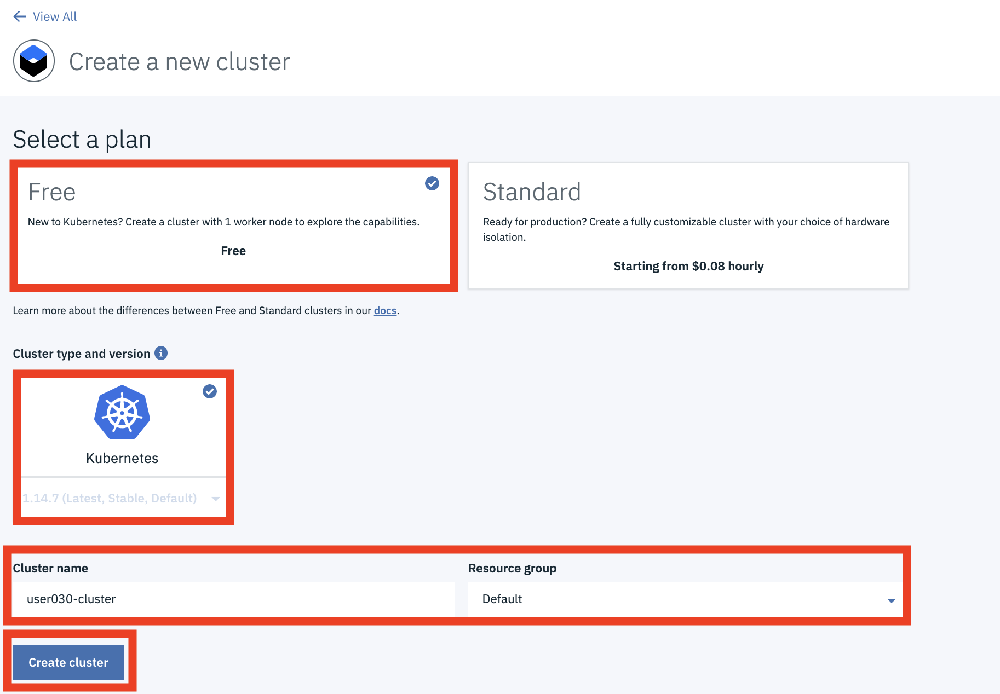

# Create a Kubernetes Cluster in IBM Cloud

## Apply a Promotional Code

You will be using an instance of IBM Kubernetes cluster during the workshop. If you login to IBM Cloud with a free IBM Cloud account, it's required to apply a promotion code to your account. The promotion code will be distributed during the session.  

If your account has privilege to create IBM Kubernetes cluster, you may skip this section.

1. login to [IBM Cloud](https://cloud.ibm.com)

2. Select `Manage` from the top menu bar, then `Account`.  

3. Within the `Account` page, select the `Account Settings` option.

4. Scroll down to locate `Subscription and feature codes` section.

5. Click `Apply code` and enter your promotion code.

## Create a Kubernetes cluster

> Note: The Kubernetes cluster name must be in the format of `user###-cluster`. `###` will be assigned to each attendee during the session. The rest of lab instructions are provided based on this name format.

1. Select [Catalog](https://cloud.ibm.com/catalog) in IBM Cloud.

2. Select `Containers` in the left pane.

2. Select `Kubernetes Service`.

4. Select `Create`. 

5. Select `Free` and `Kubernetes` option.

6. Provide a cluster name in the format of `user###-cluster`.

> Note: It's very important to keep the format when you name your cluster. `###` should have provided when the session starts.

7. Keep the default `Resource Group`.

8. Select `Create cluster`.

